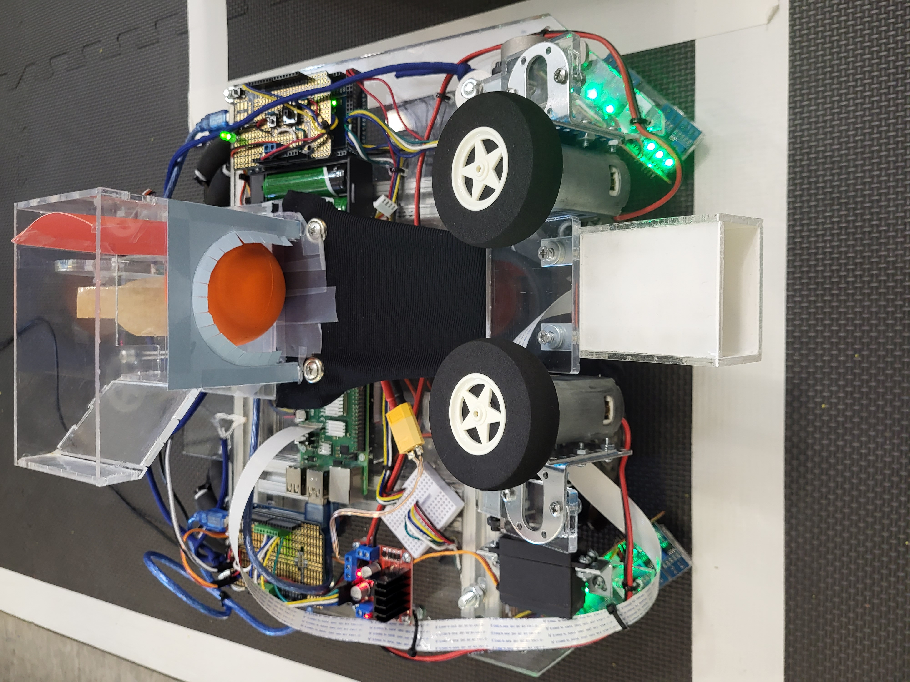

# Wii Sports Robot Project (CU Boulder Mechatronics Course)

## Table of Contents

- [About](#about)
- [Project Goals](#project-goals)
- [Specifications](#specifications)
- [Setup](#setup)
- [Usage](#usage)
- [Contributing](#contributing)
- [License](#license)

## About

Welcome to the Wii Sports Robot Project repository! This project aims to design and build a robot capable of competing in a robot version of the Wii Sports game, specifically in the bowling and ball-shooting events.

## Project Goals

The primary goal of this project is to apply engineering and programming concepts learned in an open-ended design problem. The project focuses on designing and constructing a robot that can navigate a designated area and perform tasks such as knocking down pins and shooting balls through targets.

## Specifications

- The robot is a stand-alone entity designed to navigate a designated area.
- The playing field is a rectangular foam exercise mat, and the robot operates within the marked playing area.
- Tasks include knocking down plastic bowling pins and shooting foam balls through targets.
- The robot is limited to a budget of $200 for additional components beyond the provided kit.
- The robot will autonomously navigate, target, aim, and shoot, with manual control as an option.
- Detailed specifications for tasks and scoring are provided in the project guidelines.

## Setup

1. Clone the repository to your local machine.
2. Install the required libraries and dependencies mentioned in the code.
3. Connect the robot's hardware components (motors, sensors, etc.) as per the project design.
4. Configure the serial communication with Arduino boards as per the code.

## Usage

1. Run the main program on your robot's onboard computer.
2. The robot will autonomously navigate, target, aim, and shoot based on predefined strategies.
3. Alternatively, switch to manual control mode to interactively control the robot's movements and actions using keyboard inputs.

## Contributing

Contributions to this project are welcome! If you have any ideas, suggestions, or improvements, feel free to create issues or pull requests.

## License

This project is licensed under the [MIT License](LICENSE).
